# Hackathon Website Design Inspiration

This document synthesizes five current hackathon/event pages and turns them into a practical structure and component direction for our hackathon website.

Studied pages:

| Site | URL | Strongest lesson |
| --- | --- | --- |
| Chainlink Convergence | https://chain.link/hackathon | Event brand, prize reveal, reasons-to-join, and speaker energy. |
| EasyA Consensus Hong Kong | https://www.easya.io/events/easya-consensus-hong-kong-hackathon | Real attendee photography, requirements, and credibility layering. |
| ETHGlobal HackMoney 2026 | https://ethglobal.com/events/hackmoney2026 | Complete event architecture: prizes, schedule, speakers, partners, FAQ. |
| Solana Graveyard Hackathon | https://solana.com/de/graveyard-hack | Strong theme system with clear prize, bounty, resource, and requirement modules. |
| Tempo MPP Hackathon | https://hackathon.tempo.xyz/ | Dense, conversion-focused layout with form and schedule in the first viewport. |

## Executive Synthesis

### Repeated Patterns Across The Best Pages

| Pattern | How it appears | Why it matters for our site |
| --- | --- | --- |
| Immediate event facts | Date, location/online format, prize pool, and CTA are visible in the hero on Chainlink, EasyA, Solana, Tempo, and ETHGlobal. | Hackers should know "what, when, why, and how to join" without scrolling. |
| One dominant event identity | Chainlink uses a pixel wordmark, ETHGlobal uses neon HackMoney artwork, Solana uses a gothic graveyard graphic, EasyA uses a real crowd photo, Tempo uses a terminal race aesthetic. | A hackathon needs a memorable world, not just a generic event template. |
| Prize pool near the top | Chainlink and ETHGlobal place prize summaries immediately after hero; Solana puts schedule first, then prizes. | Prize visibility establishes stakes and helps casual visitors decide whether to keep reading. |
| Tracks and sponsor bounties separated from main prizes | Solana is the clearest model: main prizes first, then a featured sponsor bounty and bounty grid. | Prevents the prize section from becoming a dense wall of amounts. |
| Schedule presented as structured data | ETHGlobal uses a timezone-aware grid, Solana uses a compact date table, Tempo uses a visual lap timeline. | Builders scan dates and deadlines; narrative schedule copy is weaker. |
| Credibility comes in layers | Speakers/judges, sponsor logos, partner logos, institution logos, testimonials, and prior community images appear across the set. | One credibility block is not enough; repeated proof points reduce doubt throughout the page. |
| Requirements and resources are near conversion moments | EasyA places requirements early; Solana places resources and requirements before the final CTA; Tempo puts the form first. | Clear submission rules reduce friction and support serious applicants. |
| FAQ is operational, not decorative | ETHGlobal provides grouped FAQ with search; Tempo uses terse terminal Q&A. | FAQ should resolve blockers: eligibility, team size, judging, remote rules, submissions, and support. |
| Final CTA repeats the primary action | Chainlink, Solana, EasyA, and ETHGlobal all end with another conversion or contact path. | Do not assume the hero CTA is enough after a long page. |

### Recommended Site Structure For Our Hackathon

Use a long-form event page with strong hero identity and clear conversion paths. The best baseline is ETHGlobal's completeness plus Solana's prize/bounty hierarchy, Chainlink's brand/prize drama, EasyA's social proof, and Tempo's low-friction application surface.

Recommended order:

1. Header
2. Hero
3. Credibility/stats
4. Prizes
5. Tracks/bounties
6. Schedule
7. Resources
8. Requirements
9. Speakers/judges
10. Partners
11. FAQ
12. Final CTA/footer

Primary CTA should be consistent across the page: `Apply`, `Register`, or `Join the Hackathon`. Secondary CTAs should be limited to `View schedule`, `Browse resources`, `See prize tracks`, and `Partner with us`.

### What Not To Copy

| Avoid | Seen in | Reason |
| --- | --- | --- |
| Off-page registration as the only visible conversion path | Chainlink, Solana, EasyA | Fine for established brands, but our site should keep the main application path more prominent. |
| Very dim scroll-reveal states | Solana | Atmospheric but risky for readability and screenshot clarity. |
| Hero artwork without enough live text | ETHGlobal, Chainlink, Solana | Custom logos are memorable, but the event name, date, and CTA should remain accessible as live text too. |
| App-download CTA replacing event signup | EasyA | Useful for EasyA's platform, but not our primary user journey. |
| No conventional nav on a content-rich page | Tempo | Works for a tiny page, but our target structure needs anchors for prizes, schedule, FAQ, and resources. |
| Logo walls without hierarchy | Risk across all event pages | Partner sections should be grouped by role, tier, or contribution so they stay scannable. |

## 1. Chainlink Convergence

**URL:** https://chain.link/hackathon

### Screenshot Gallery

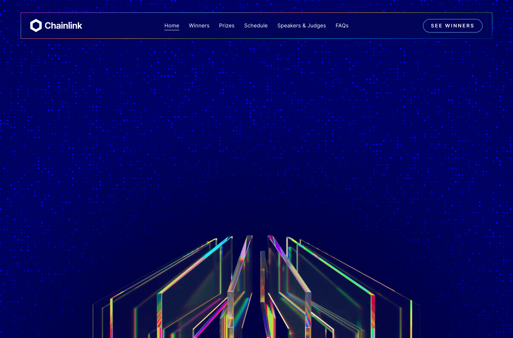
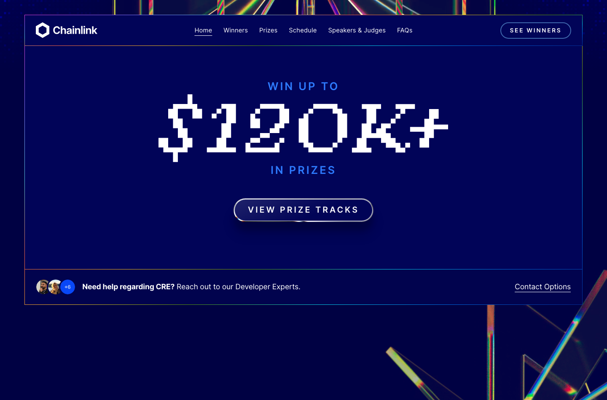
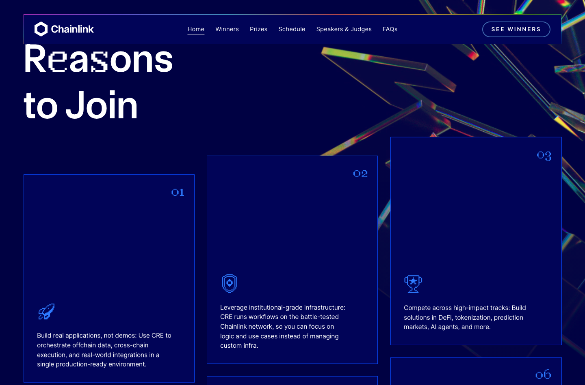
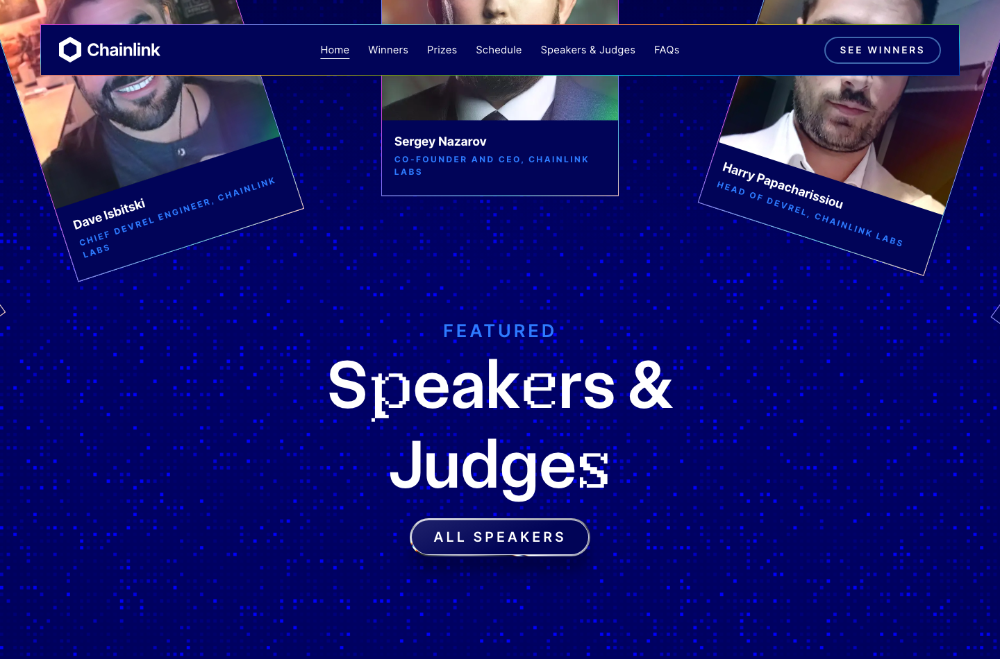
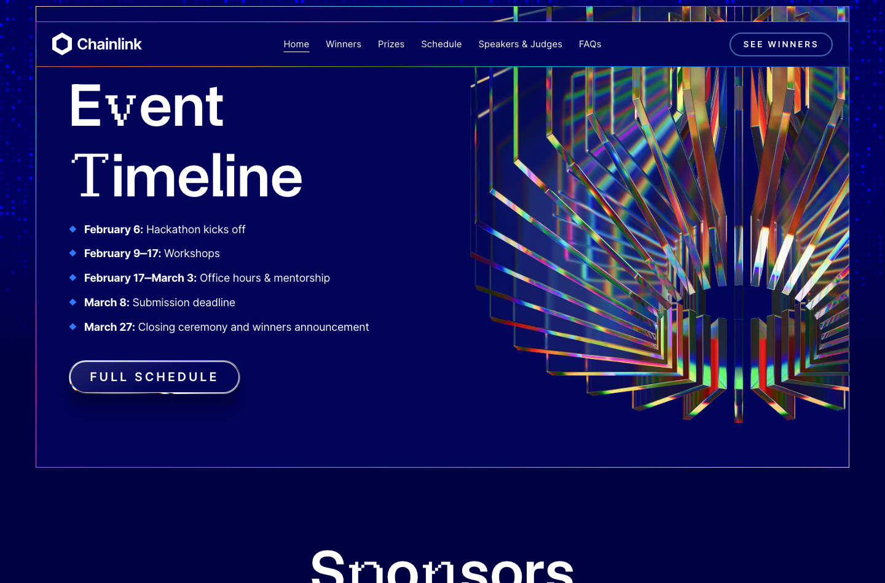
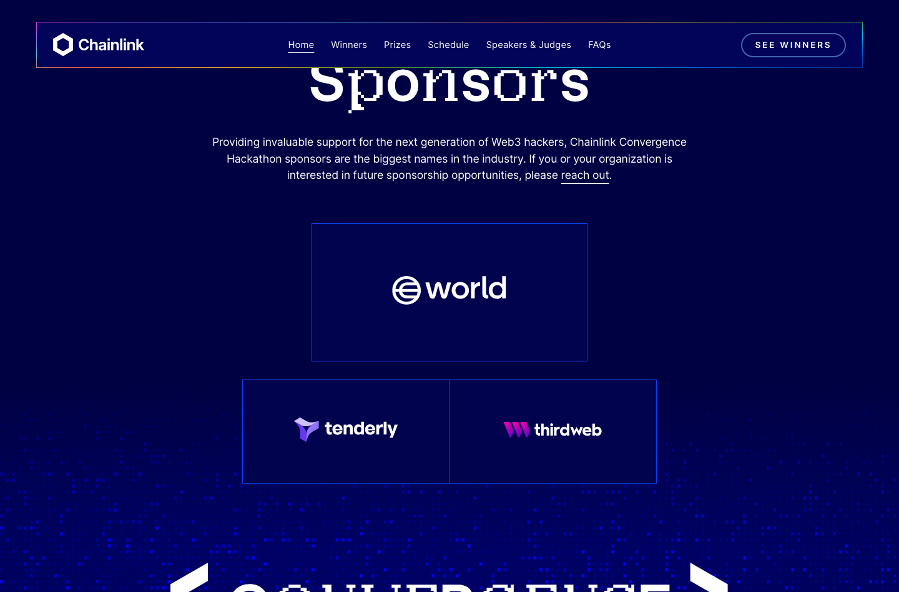
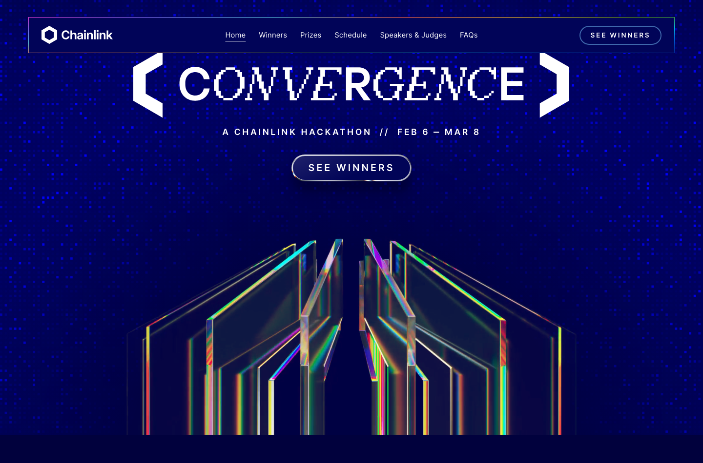
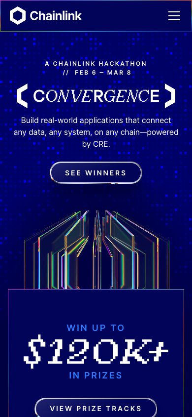

### Exact Page Structure / Order

1. Sticky navigation: Chainlink logo, Home, Winners, Prizes, Schedule, Speakers & Judges, FAQs, and a pill CTA labeled `See Winners`. Mobile collapses to logo plus hamburger.
2. Hero: event label `A Chainlink Hackathon // Feb 6 - Mar 8`, large pixel-art `CONVERGENCE` wordmark, copy about building real-world applications powered by CRE, primary CTA, and prismatic glass corridor imagery.
3. Prize lockup: huge `$120K+` pixel-number centerpiece with `Win up to`, `In Prizes`, and `View Prize Tracks` CTA.
4. Developer-help CTA strip: avatar stack, support message, and `Contact Options` link.
5. Reasons to Join: six bordered cards with icons, numbered corners, and concise benefit copy.
6. Featured Speakers & Judges: tilted photo cards surrounding centered heading and `All Speakers` CTA.
7. Event Timeline: split section with title, diamond-bullet date list, `Full Schedule` CTA, and prismatic radial image.
8. Sponsors: centered heading, short sponsor copy, bordered logo blocks, and mailto-style reach-out link.
9. Final CTA: repeated event wordmark/date lockup, `See Winners` CTA, and corridor image.
10. Footer: logo, social icons, copyright, Privacy Policy, and Terms of Service.

### Component Inventory

| Component | Notes |
| --- | --- |
| Sticky navbar | Bordered desktop nav with repeated primary CTA; mobile hamburger. |
| Event hero | Centered label, custom wordmark, concise body copy, pill CTA, immersive bitmap/3D visual. |
| Prize statistic | Oversized numeric moment in a contained dark panel. |
| Support strip | Avatar stack plus developer-help link, useful as a low-friction support module. |
| Reasons cards | Six equal cards with icon, number, title, and short copy. |
| Speaker cards | Photo cards with dark caption bands and slightly angled placement. |
| Timeline | Static date list with diamond markers and bold dates. |
| Sponsor cards | Simple bordered logo cards on dark background. |
| Footer | Compact brand, social, and legal links. |

### Color Schema

| Token | Hex / value | Use |
| --- | --- | --- |
| Deep page navy | `#01014A`, `#010458` | Main body and large section backgrounds. |
| Dark panel navy | `#000344`, `#000650` | Navbar and contained panels. |
| Chainlink blue | `#2E7BFF` | Labels, card numbers, timeline markers, links. |
| Pale blue border | `#7DCBFF` at partial opacity | Borders and highlights. |
| White | `#FFFFFF` | Primary text and logos. |
| Pale sponsor fill | `#E9F0FF` | Sponsor/speaker internals. |
| Button dark | `#000000` | Main button fill with white text and blue/white outline. |

### Typography / Visual Style

- Body typography uses Inter with Tahoma/sans-serif fallback.
- Major headings and prize numerals use the pixel-styled `argent-pixel-cf`.
- Visual system is cyber/prismatic: dark navy, neon blue, glass corridor images, chromatic edges, and thin luminous borders.
- Hierarchy is high contrast: very large display moments paired with compact 15-18px body text.
- Desktop layout is spacious and centered, with fixed-width cards and strong section breaks.

### Reusable Design Takeaways

- Make the event identity the first-viewport anchor and repeat it near the footer.
- Place the prize pool immediately after the hero for momentum.
- Use a compact help/support strip near the top; it signals that first-time builders will not be stranded.
- Reasons-to-join cards are strongest when each has a number, icon, and one short benefit.
- Speaker/judge cards can be more dynamic than a strict grid, but the CTA and heading should stay centered.

## 2. EasyA Consensus Hong Kong Hackathon

**URL:** https://www.easya.io/events/easya-consensus-hong-kong-hackathon

### Screenshot Gallery

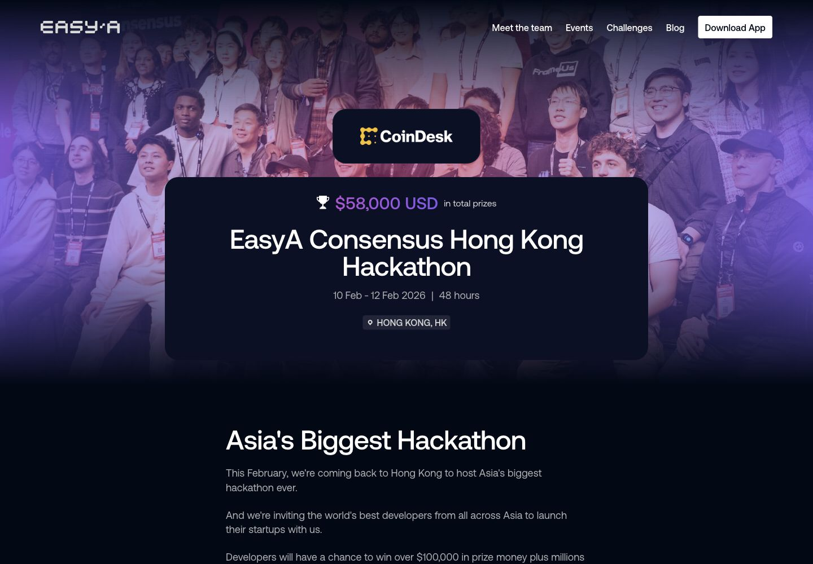
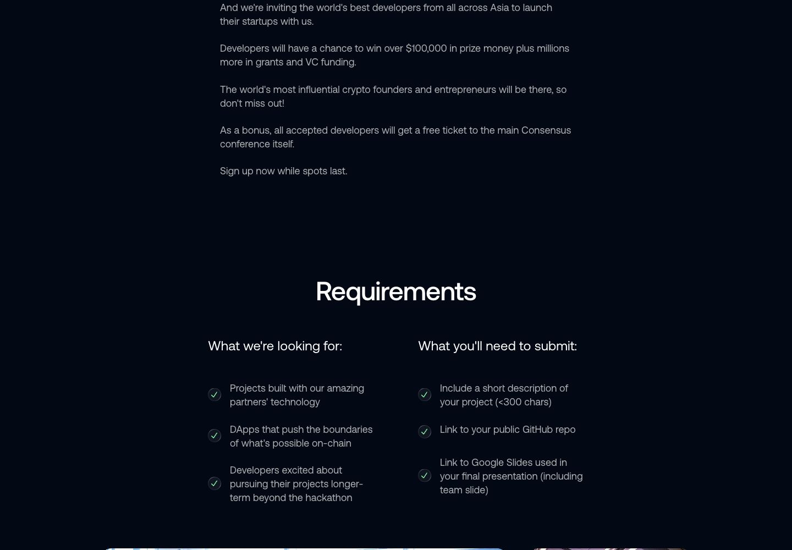
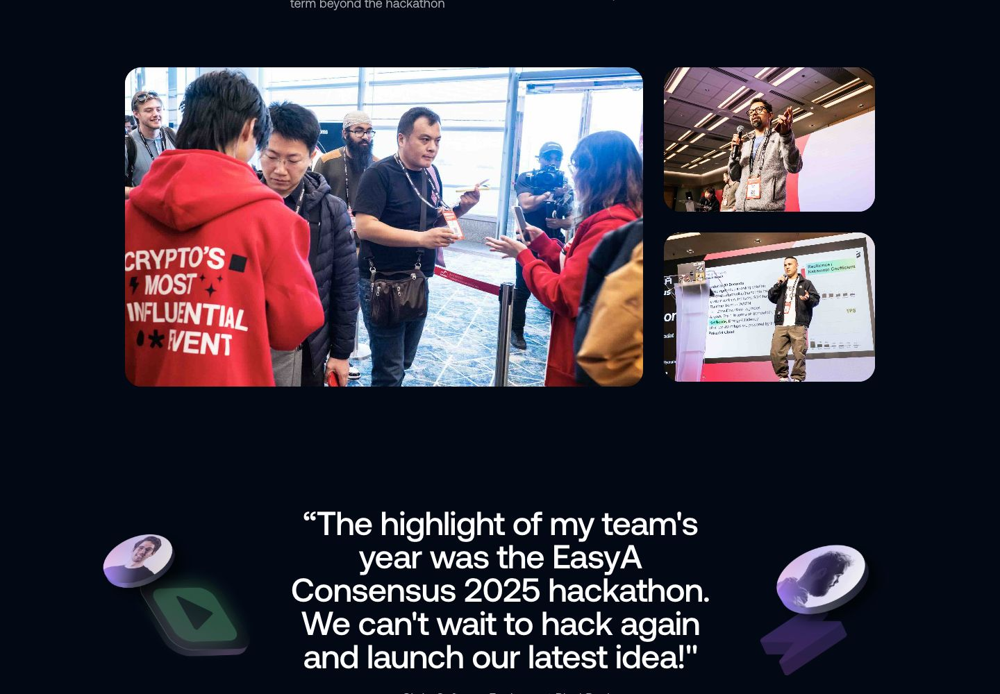
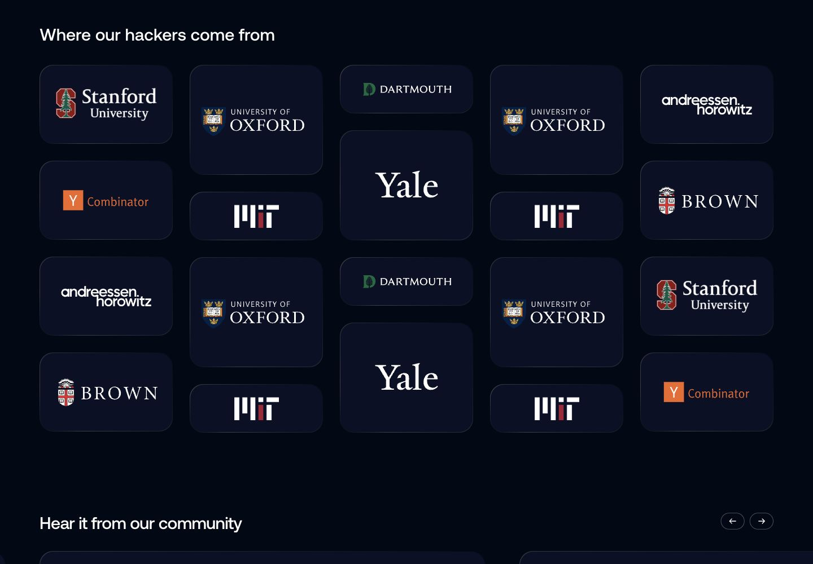
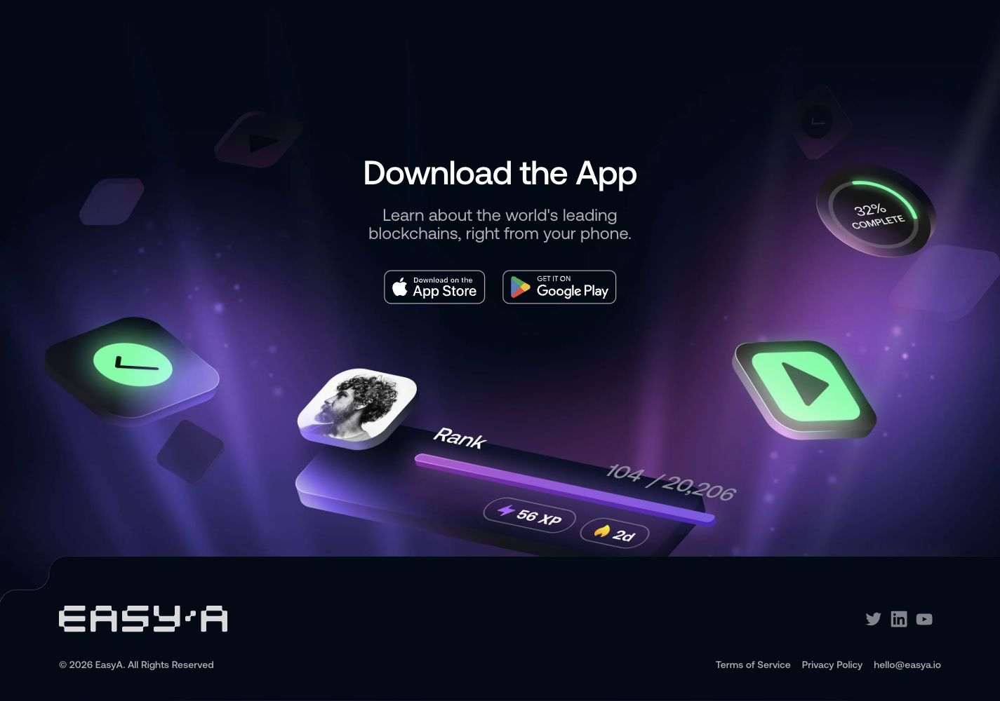
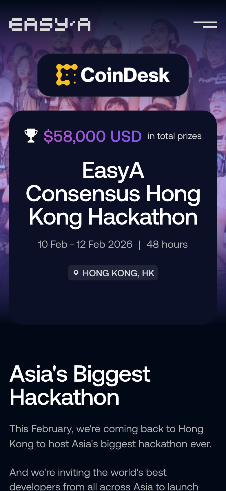
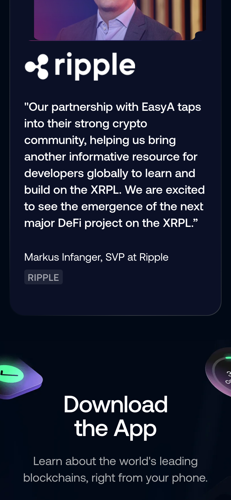

### Exact Page Structure / Order

1. Header and hero: transparent nav over full-bleed hackathon group photo. Nav includes EasyA logo, Meet the team, Events, Challenges, Blog, and white `Download App` button.
2. Hero content: CoinDesk pill, prize line, event title, date/duration, and Hong Kong location chip.
3. Event overview: centered text column headed `Asia's Biggest Hackathon`, with copy about founders, prizes, grants, Consensus ticket bonus, and signup urgency.
4. Requirements: centered title with two checklist columns: what EasyA is looking for and what submissions require.
5. Event imagery and quote: asymmetrical photo collage followed by a large centered testimonial attributed to Chris, Software Engineer at BlackRock.
6. Hacker origin logo grid: `Where our hackers come from` with dark credibility-logo tiles for universities, Y Combinator, and a16z.
7. Community testimonials: horizontal carousel cards with portraits/media, partner logos, quotes, attribution, and arrows.
8. Download app CTA: centered section over dark purple app-themed 3D background with App Store and Google Play badges.
9. Footer: logo, copyright, social icons, Terms of Service, Privacy Policy, and contact email.

### Component Inventory

| Component | Notes |
| --- | --- |
| Transparent nav | Logo, text links, white CTA, mobile hamburger. |
| Photo hero | Full-bleed real crowd image with dark/purple overlay. |
| Metadata card/chips | Prize, title, date, duration, location, and partner pill. |
| Requirements checklists | Two-column list with circular green checks. |
| Photo collage | One large event image plus smaller presentation images. |
| Pull quote | Large centered quote used as social proof. |
| Credibility logo wall | Dark masonry-style institution/company logo grid. |
| Testimonial carousel | Partner cards with image, logo, quote, and arrow controls. |
| App CTA | 3D app artwork background plus store badges. |
| Footer | Standard brand, social, legal, and email links. |

### Color Schema

| Token | Hex / value | Use |
| --- | --- | --- |
| Page background | `#010916` | Main deep navy background. |
| Surface/card background | `#0B1026` | Hero card, logo tiles, testimonial cards. |
| Primary text | `#FFFFFF` | Headings, nav, key copy. |
| Muted text | `#AEB0B2` | Paragraphs, metadata, footer copy. |
| Translucent chip | `rgba(217,217,217,0.10)` | Hero tags and location chips. |
| Soft border | `rgba(255,255,255,0.06-0.18)` | Cards and carousel controls. |
| Purple accent | `#A95DFF` approx. | Prize amount and glow effects. |
| Green accent | `#6EF7A0` approx. | Checklist checks and app visual highlights. |
| CoinDesk yellow | `#FFD23F` approx. | CoinDesk logo mark. |
| White button text color | `#010916`, `#333333` | Text inside white nav CTA. |

### Typography / Visual Style

- Typography uses Aeonik, sans-serif.
- Hero and section headings are large but not oversized; desktop headings sit around 48px.
- The page is immersive and editorial: real photos, dark overlays, purple/blue glows, high-radius dark cards, and soft borders.
- Layout alternates between centered text, two-column checklists, asymmetrical media, logo grids, and carousel cards.
- Social proof is a central design device, not an afterthought.

### Reusable Design Takeaways

- Use real event/community photography when we need instant trust and attendance energy.
- Put event facts in one scannable cluster: prize, name, dates, duration, and location.
- Requirements should be visible before deep social proof so builders can self-qualify.
- Credibility works best in layers: partner pill, founder/community quote, institution logos, and testimonials.
- Do not let app download or platform CTAs compete with the primary hackathon registration CTA.

## 3. ETHGlobal HackMoney 2026

**URL:** https://ethglobal.com/events/hackmoney2026

### Screenshot Gallery

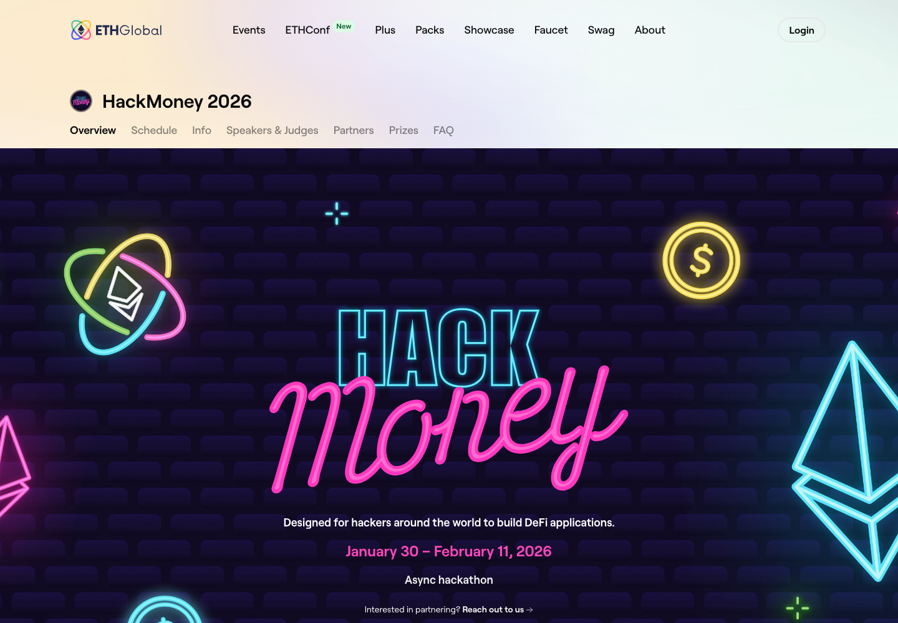
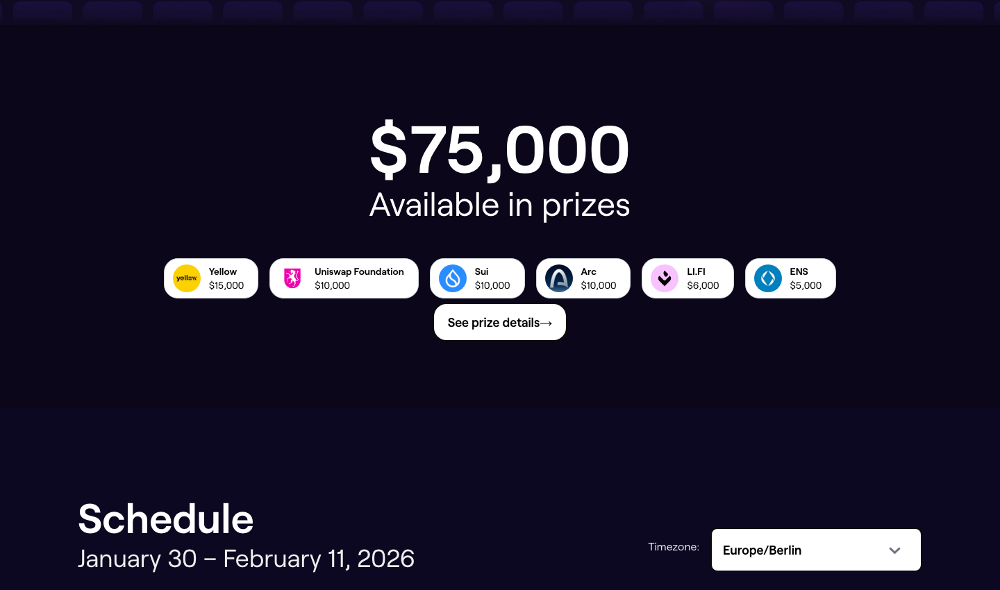
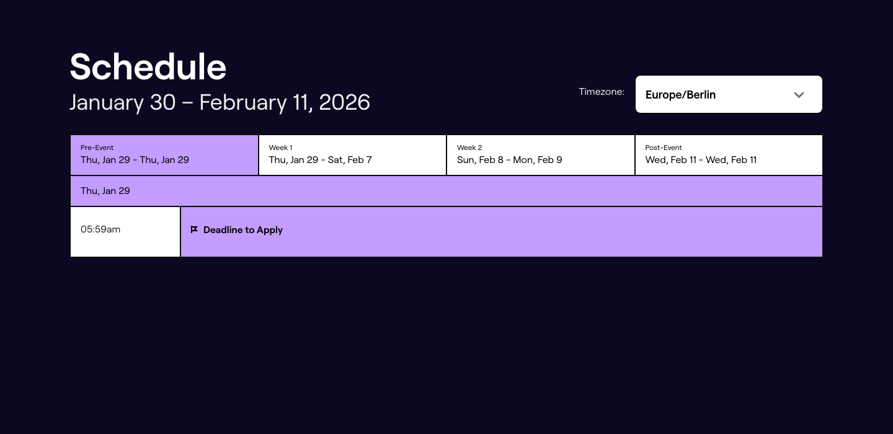
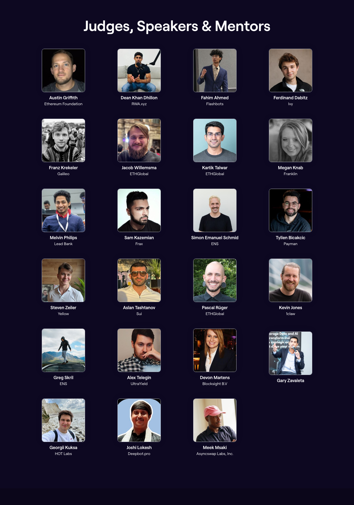
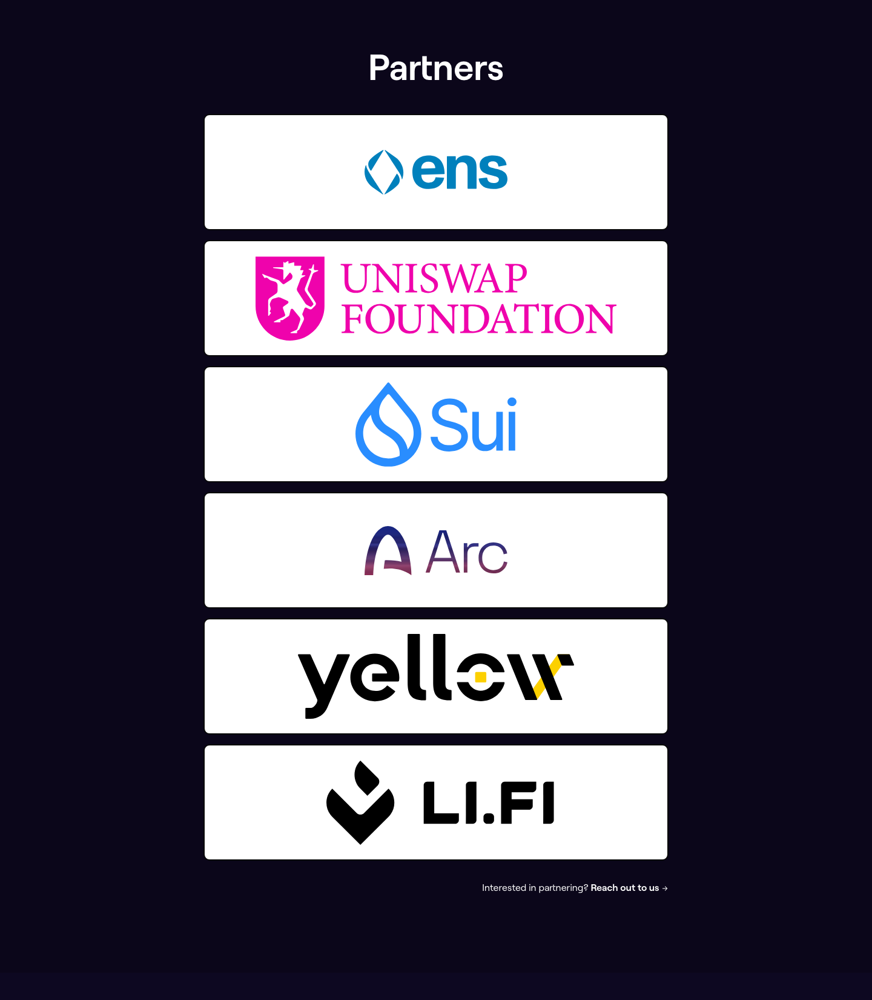
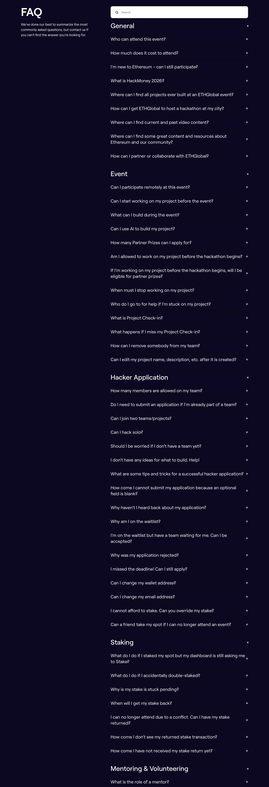
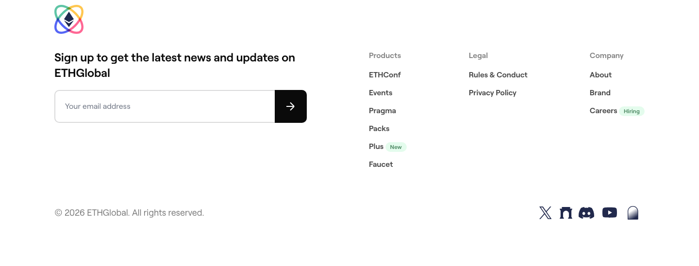

### Exact Page Structure / Order

1. Global header: pastel gradient bar with ETHGlobal logo and primary nav links for Events, ETHConf, Plus, Packs, Showcase, Faucet, Swag, About, and Login.
2. Event identity row: HackMoney icon, `HackMoney 2026`, and event subnav with Overview, Schedule, Info, Speakers & Judges, Partners, Prizes, and FAQ.
3. Hero: dark neon HackMoney artwork with brick-wall backdrop, crypto icons, short DeFi copy, event dates, async format, and partner CTA.
4. Prize summary: centered `$75,000` headline, `Available in prizes`, sponsor amount pills, and `See prize details->` CTA.
5. Schedule: date range, timezone dropdown, and four-column timeline for Pre-Event, Week 1, Week 2, and Post-Event.
6. Judges, Speakers & Mentors: large centered heading and four-column desktop portrait grid.
7. Partners: centered heading and vertical stack of oversized white sponsor-logo panels.
8. FAQ: two-column layout with intro text on left, search field and grouped accordion questions on right.
9. Newsletter and footer: email signup form, product/legal/company link columns, copyright, and social icons.

### Component Inventory

| Component | Notes |
| --- | --- |
| Two-tier navigation | Global nav plus event anchor subnav with active state. |
| Branded hero image | Large neon artwork carries the event identity. |
| Event facts | Date and async format sit directly under hero copy. |
| Partner CTA | Inline `Reach out to us` link appears in hero and partners. |
| Prize pills | Sponsor logo, sponsor name, and amount in compact horizontal pills. |
| Schedule grid | Timezone select plus table-like week columns. |
| Profile cards | Square image, name, and organization in repeated grid. |
| Partner cards | Large white cards in single vertical column. |
| FAQ system | Search input, group headers, accordion rows, plus icons. |
| Newsletter form | Email input and square submit button in footer. |

### Color Schema

| Token | Hex / value | Use |
| --- | --- | --- |
| Dark page background | `#0B061A`, `#0D0821` | Main dark body background. |
| Hero purple/black | `#110B2F`, `#08051A` | Neon artwork region. |
| Pastel header gradient | `#FFF2D8`, `#F3EEFF`, `#EAFBFA` | Global header. |
| Primary light text | `#FFFFFF` | Dark-section headings and body. |
| Primary dark text | `#0A0A0A` | Footer, white cards, buttons. |
| Muted light text | `#EEEEEE`, `#C7C5D2` | Supporting copy. |
| Neon pink | `#FF48BA` | Hero accent. |
| Neon cyan | `#39E7FF` approx. | Hero accent. |
| Neon yellow/gold | `#FFE45C` approx. | Hero and prize accents. |
| Schedule lavender | `#C39DFF` | Schedule event row. |
| Card/input white | `#FFFFFF` | Partner cards, FAQ/search/footer inputs. |
| Border gray | `#E5E7EB`, `#DADADB` | Cards and input borders. |
| Green badge | `#DCFCE7` / `#166534` | `New` and hiring-style badges. |
| Black button | `#0A0A0A` | Footer submit button. |

### Typography / Visual Style

- Font stack observed: Roobert, serif.
- The main hero title is a bitmap/logo treatment rather than live headline text.
- Section headings are bold, large, and centered on dark backgrounds.
- UI chrome is clean and rounded: pills, cards, inputs, accordion rows, and partner panels.
- Visual identity is neon DeFi arcade: deep purple, pink/cyan/yellow glow, crypto iconography, and ETHGlobal's clean product UI.

### Reusable Design Takeaways

- Use two-tier navigation if we need both site-wide links and in-page event anchors.
- Prize sponsor pills are a compact way to summarize many top-line awards.
- A timezone-aware schedule is essential for async, hybrid, or global hackathons.
- Speakers and judges do not need an elaborate layout; a reliable portrait grid is enough.
- FAQ search plus grouped accordions is the strongest model in the set for long operational FAQs.
- Partner logo cards should be large enough to feel intentional, not buried in a tiny strip.

## 4. Solana Graveyard Hackathon

**URL:** https://solana.com/de/graveyard-hack

### Screenshot Gallery

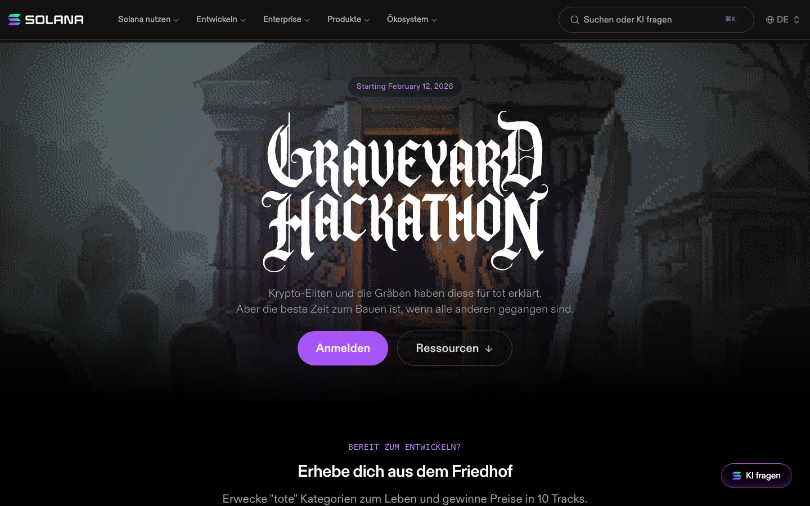
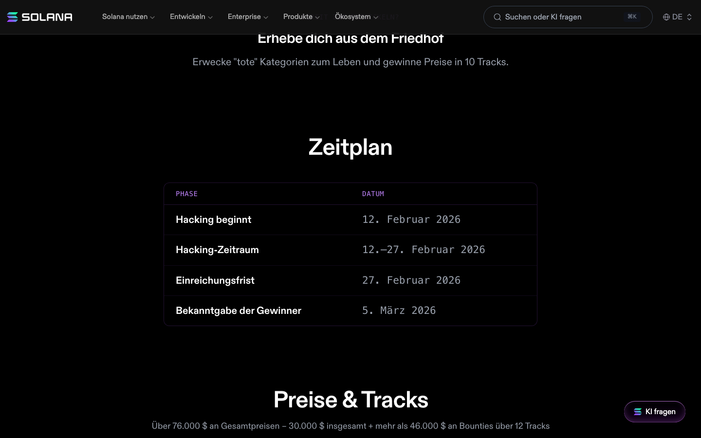
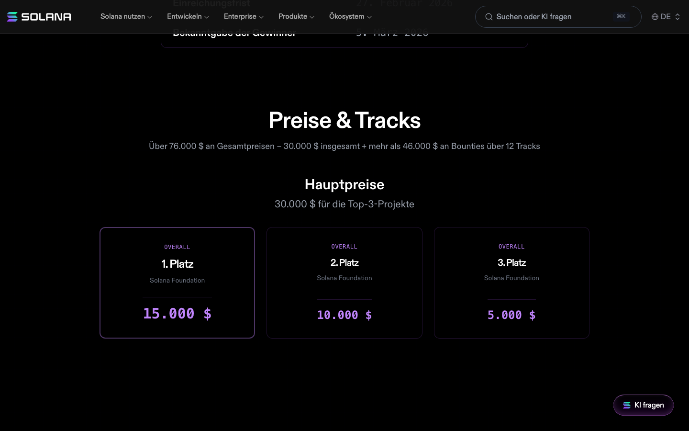
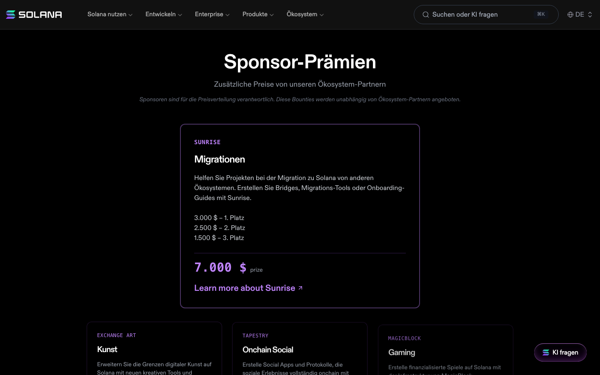
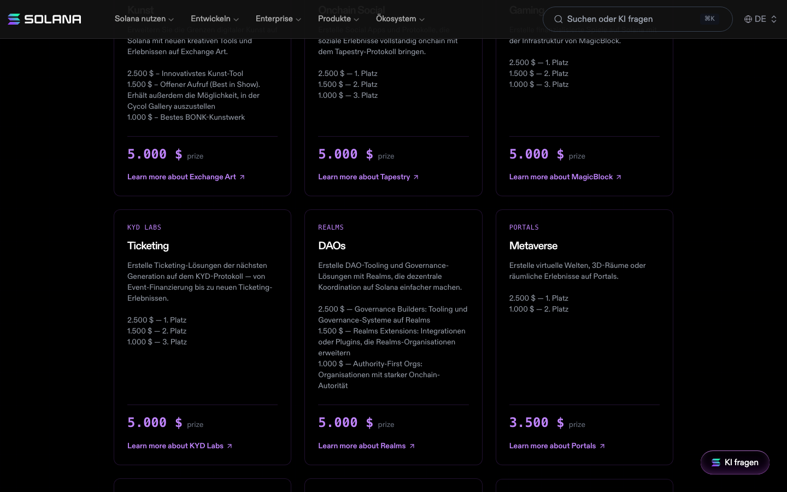
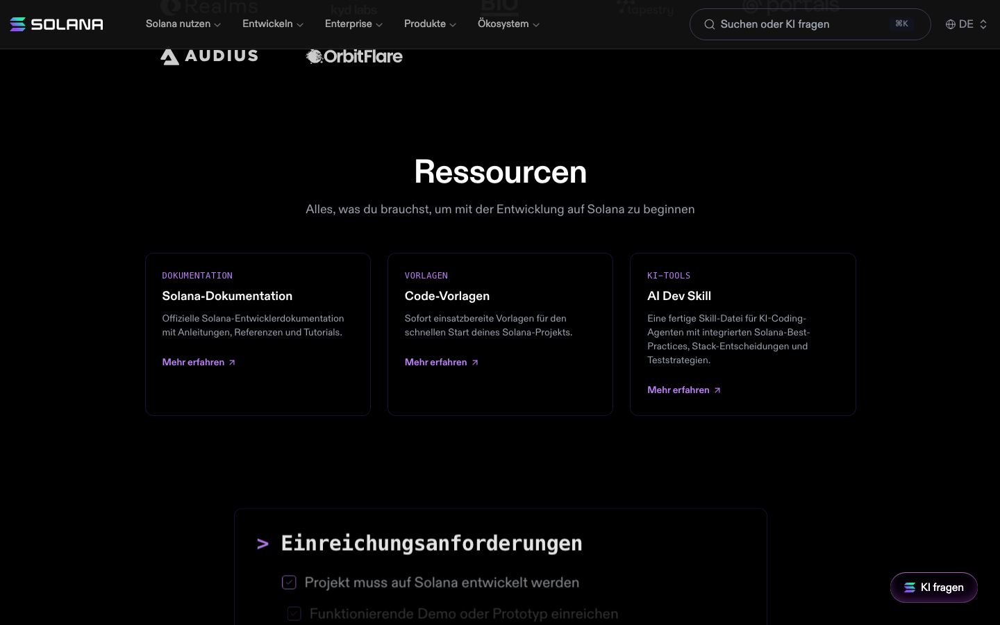
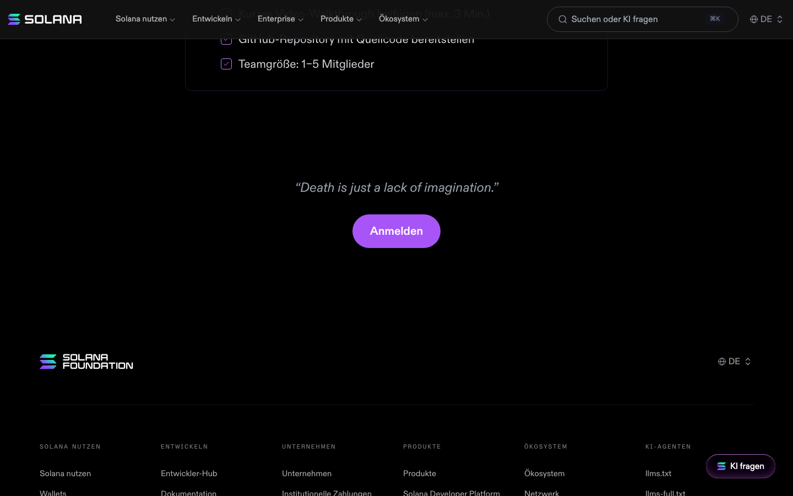
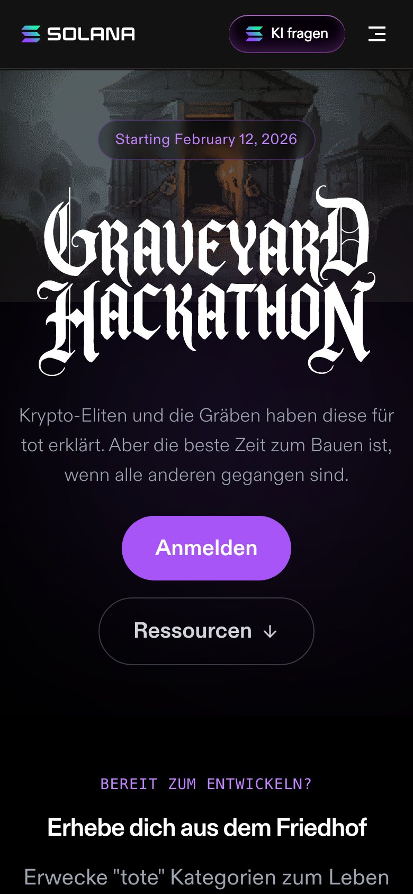

### Exact Page Structure / Order

1. Sticky global Solana header: logo, dropdown nav groups, command-search pill, language selector, and `KI fragen` entry point. Mobile uses logo, AI pill, and hamburger.
2. Hero: dark pixel-art graveyard background, date pill `Starting February 12, 2026`, blackletter `Graveyard Hackathon` graphic, German subcopy, `Anmelden` CTA, and `Ressourcen` anchor CTA.
3. Intro statement: eyebrow `Bereit zum Entwickeln?`, heading `Erhebe dich aus dem Friedhof`, and short premise about reviving dead categories across 10 tracks.
4. Timeline: centered `Zeitplan` table with four rows: hacking begins, hacking period, submission deadline, and winners announced.
5. Prizes and tracks: total prize headline above `$76,000`, with three main Solana Foundation prize cards: `$15,000`, `$10,000`, and `$5,000`.
6. Sponsor bounties: featured wide Sunrise migration bounty card followed by 3-column partner bounty grid.
7. Partner/logo and event strip: monochrome partner logos and small event/date labeling.
8. Resources: three link cards for documentation, code templates, and AI Dev Skill.
9. Submission requirements: bordered checklist card for Solana build, demo/prototype, video walkthrough, GitHub source, and team size.
10. Final CTA: centered quote, `Anmelden` button, and Solana Foundation footer.
11. Footer: multi-column global footer with language selector, social icons, legal links, copyright, and subtle line-art decoration.

### Component Inventory

| Component | Notes |
| --- | --- |
| Global sticky nav | Dropdown labels, search/command palette, language control, AI chat pill. |
| Themed hero | Full-bleed pixel-art background, large gothic event mark, date pill, dual CTAs. |
| Intro statement | Short thematic framing between hero and schedule. |
| Schedule table | Bordered table with purple labels and large monospaced dates. |
| Main prize cards | Dark cards with purple borders, sponsor/category labels, divider lines, and large amounts. |
| Sponsor bounty grid | One featured wide card plus repeated 3-column card grid. |
| Partner strip | Monochrome logos as transition into builder resources. |
| Resource cards | Eyebrow, title, description, and `Mehr erfahren` link. |
| Requirements checklist | Bordered checklist card with square check icons. |
| Final CTA | Quote plus repeated registration button. |

### Color Schema

| Token | Hex / value | Use |
| --- | --- | --- |
| Page background | `#000000`, `#121212` | Black and charcoal body base. |
| Header surface | `#111111`, `#151515` | Sticky nav. |
| Primary text | `#FFFFFF` | Headings, card titles, CTAs. |
| Secondary text | `#9CA3AF`, `#A0A5B1` | Body copy, dates, footer links. |
| Muted nav text | `rgba(255,255,255,0.64)` | Desktop nav labels. |
| Primary CTA purple | `#A855F7` | Registration buttons. |
| Link/accent purple | `#C084FC`, `#A63EFF` | Prize amounts, labels, outlines, links. |
| Solana green | `#00FFC2`, `#14F195` | Brand accents and resource highlights. |
| Border purple | `#3B145F`, `#6B2AA0` approx. | Cards, timeline table, pills. |
| Card fill | `#000000` with translucent overlays | Prize, bounty, resource, and requirement cards. |

### Typography / Visual Style

- Body typography uses Solana's Diatype stack with Helvetica/Arial/system fallbacks.
- Hero title is a custom blackletter graphic; dates and prize amounts use a technical monospaced feel.
- The style is heavily themed: gothic event mark, pixel graveyard art, black surfaces, purple outlines, and ghostly dimming.
- Layout remains straightforward despite the theme: centered content blocks, tables, prize cards, bounty grids, and checklists.
- Desktop uses 3-column bounty/resource grids; mobile stacks into single-column cards.

### Reusable Design Takeaways

- A strong event world works if the information architecture stays simple.
- Put schedule early when dates and deadlines are central to participation.
- Separate main prizes from sponsor bounties; use a featured bounty plus grid for hierarchy.
- Resource cards and requirements should sit close to the final CTA.
- Watch contrast carefully if using scroll-reveal or low-opacity atmospheric effects.

## 5. Tempo MPP Hackathon

**URL:** https://hackathon.tempo.xyz/

### Screenshot Gallery

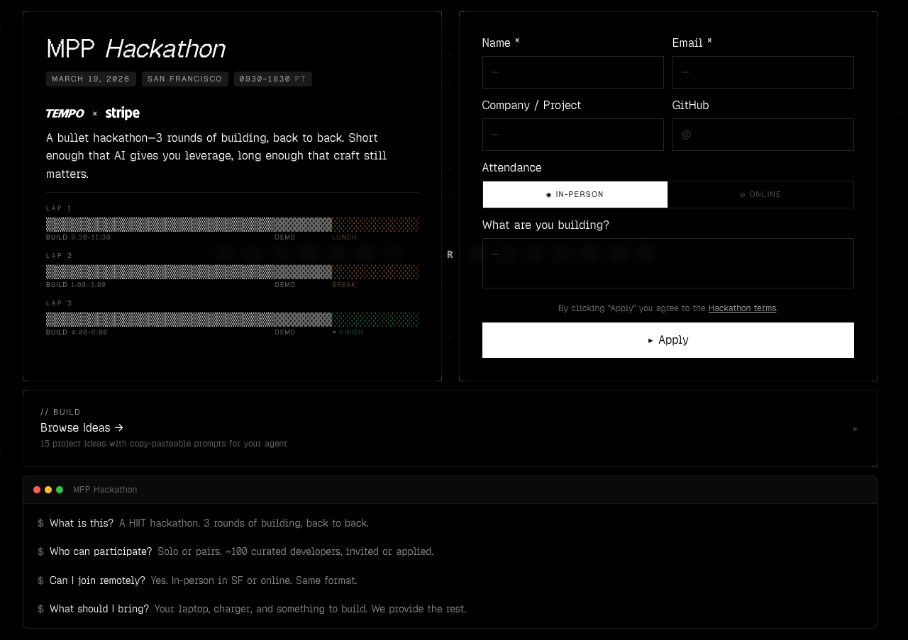
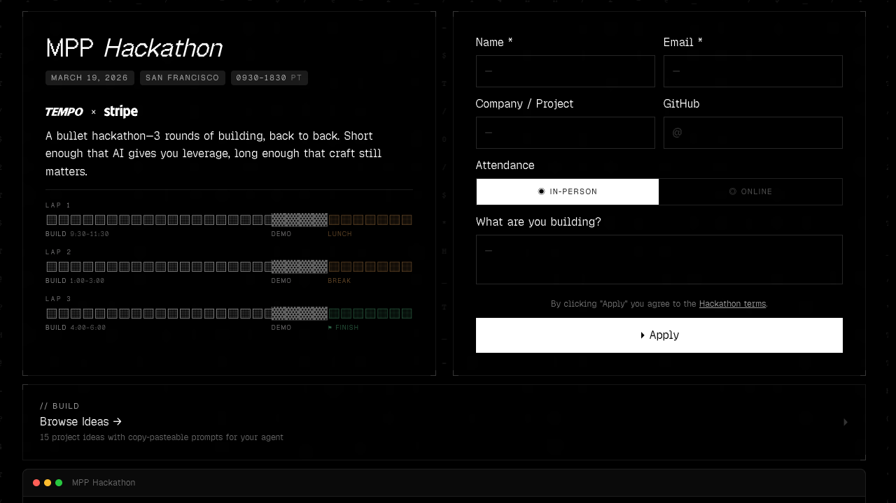
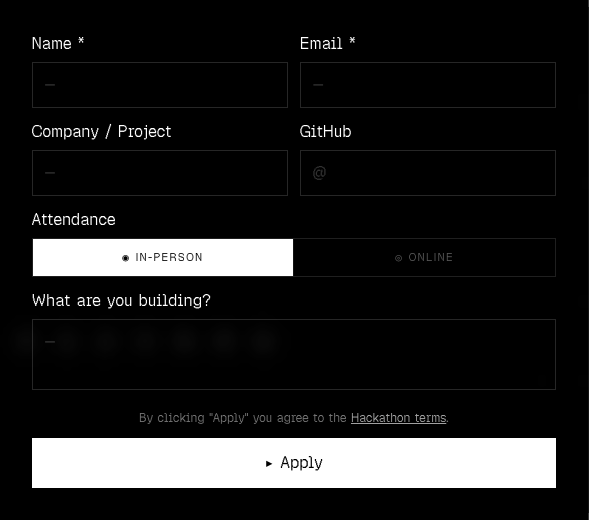
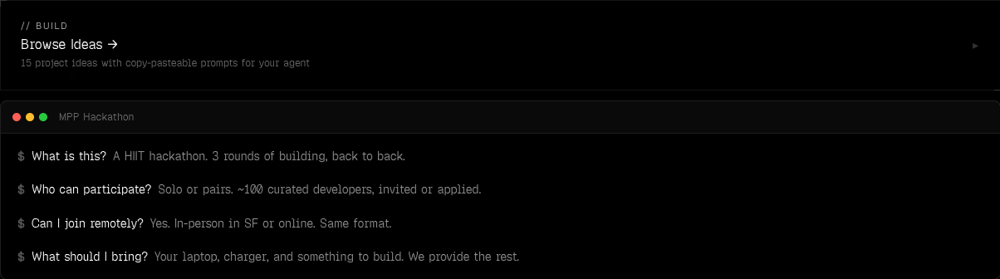
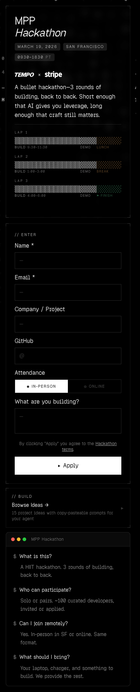

### Exact Page Structure / Order

1. Intro / hero panel: event name `MPP Hackathon`, metadata chips for date, location, and time, Tempo x Stripe marks, compact event pitch, and three lap timeline rows.
2. Application form panel: two-column desktop field grid for name, email, company/project, GitHub, attendance segmented control, textarea, terms acknowledgement, and full-width `Apply` button.
3. Build ideas CTA: full-width terminal/link row with `// BUILD`, `Browse Ideas ->`, short support copy, and triangular arrow indicator.
4. FAQ / footer terminal: terminal-window card with red/yellow/green dots, static Q&A entries using `$` prompt markers, and no separate footer navigation.

### Component Inventory

| Component | Notes |
| --- | --- |
| Compact event header | Event title and metadata chips replace conventional nav. |
| Partner marks | Tempo and Stripe logos near the top. |
| Timeline visualization | Three lap rows with patterned bars and colored end segments. |
| Application form | Labeled inputs, segmented attendance control, textarea, terms link, full-width CTA. |
| Primary CTA | White `Apply` button on black. |
| Secondary CTA | `Browse Ideas` terminal-style link row. |
| FAQ terminal | Static expanded Q&A block with prompt markers and terminal dots. |
| Footer | Merged into FAQ; no large footer band. |

### Color Schema

| Token | Hex / value | Use |
| --- | --- | --- |
| Page background | `#000000` | Full page base. |
| Main text | `#FFFFFF` | Headings, labels, primary copy. |
| Muted text | `#B3B3B3`, `#666666` | Support text and secondary labels. |
| Panel/border lines | `rgba(255,255,255,0.15)`, `#262626` approx. | Thin panel outlines and dividers. |
| Chip/background tint | `rgba(255,255,255,0.08)`, `#141414` approx. | Metadata chips and subtle surfaces. |
| Button background | `#FFFFFF` | Primary submit button. |
| Button text | `#000000` | Primary submit text. |
| Timeline amber | `#FEBC2E` | Lunch/end-state accent. |
| Timeline green | `#28C840`, `#2A5E42` | Finish/end-state accent. |
| Terminal red | `#FF5F57` | Window control dot. |
| Warm timeline shadow | `#6B4C2A` | Timeline pattern accent. |
| Near-black undertone | `#0A0A0F` | Panel and background depth. |

### Typography / Visual Style

- Font stack observed: `Geist Pixel Square`, `Geist Mono`, ui-monospace, monospace.
- Entire page uses a terminal/code aesthetic: monospace type, ASCII-style bars, `$` prompts, `//` labels, thin borders, and rectangular controls.
- Layout is dense and utility-focused: top desktop viewport contains event info and application form side by side.
- Desktop grid is simple: two top panels, then full-width CTA and FAQ rows.
- Mobile stacks the same modules in order without changing the information model.

### Reusable Design Takeaways

- Put application mechanics close to event facts when conversion speed matters.
- A schedule can become a visual signature if the format is part of the event concept.
- Terminal styling is effective for developer audiences when hierarchy and labels stay clear.
- A project-ideas CTA is a useful bridge for visitors who are interested but not ready to apply.
- A compact FAQ can act as the page close for small events, but larger hackathons still need a proper footer.

## Final Proposed Structure For Our Website

1. **Header**
   - Sticky desktop nav with event logo/name, anchor links, and one persistent primary CTA.
   - Suggested anchors: Overview, Prizes, Tracks, Schedule, Resources, Judges, Partners, FAQ.
   - Mobile: logo, CTA, hamburger. Avoid hiding the primary CTA inside the menu.

2. **Hero**
   - First viewport should include event name, date range, location/online format, prize pool, one-sentence value proposition, and primary CTA.
   - Use one strong visual system: real event/community image, generated branded artwork, or high-quality themed bitmap. Keep live text available for accessibility and scanning.
   - Secondary CTA: `View schedule` or `Browse resources`.

3. **Credibility/stats**
   - Compact stat row or proof strip directly after hero.
   - Possible stats: prize pool, number of tracks, mentors/judges, participating partners, hours/days of hacking, expected hackers.
   - Include partner or community logos only if they support trust, not as decoration.

4. **Prizes**
   - Large top-line prize pool.
   - Main prize cards: 1st, 2nd, 3rd, special categories if needed.
   - Include clear labels for eligibility and judging basis.

5. **Tracks/bounties**
   - Separate sponsor bounties and thematic tracks from main prizes.
   - Use one featured bounty card if there is a lead sponsor or signature challenge.
   - Follow with a 2- or 3-column card grid: track name, sponsor, award, short challenge brief, and `Learn more`.

6. **Schedule**
   - Structured schedule table, not paragraph copy.
   - Include timezone handling if virtual or international.
   - Must show application deadline, hacking start, workshops/checkpoints, submission deadline, judging, demos, and winner announcement.

7. **Resources**
   - Cards for docs, starter templates, APIs, office hours, example project ideas, Discord/Slack, and mentor booking.
   - Keep the section action-oriented: every card should link somewhere useful.

8. **Requirements**
   - Checklist card for eligibility, team size, submission assets, repo/demo/video needs, allowed prior work, and judging criteria.
   - Place near resources so applicants can move from "how to build" to "how to submit."

9. **Speakers/judges**
   - Portrait grid with names, roles, company, and optional tags for judge, mentor, or speaker.
   - If the roster is small, combine speakers/judges/mentors into one grid with filters or labels.

10. **Partners**
   - Group by role: organizing partners, sponsors, bounty partners, community partners.
   - Use logo cards or strips with consistent sizing and contrast.
   - Include a `Partner with us` CTA only if partnership is still open.

11. **FAQ**
   - Grouped accordion with search if there are more than 10 questions.
   - Required topics: eligibility, team size, remote participation, application review, judging, prizes, IP ownership, code reuse, submission format, support, and travel/location.

12. **Final CTA/footer**
   - Repeat the event name, date, and primary CTA.
   - Footer should include social/community links, contact, legal links, and partner/organizer attribution.

## Consolidated Component Checklist

| Component | Include? | Direction |
| --- | --- | --- |
| Sticky header | Yes | Use anchor nav plus persistent CTA. |
| Mobile hamburger | Yes | Keep CTA visible outside the menu. |
| Event hero artwork | Yes | One distinctive bitmap/photo/themed visual, not generic gradients. |
| Event metadata chips | Yes | Date, location/format, application deadline, prize pool. |
| Primary CTA | Yes | Use one label consistently across header, hero, and final CTA. |
| Secondary CTA | Yes | Limit to schedule/resources/prizes. |
| Prize pool lockup | Yes | Large number plus concise prize explanation. |
| Main prize cards | Yes | Clear rank/category, amount, sponsor if relevant. |
| Sponsor bounty grid | Yes | Separate from main prizes. |
| Schedule table | Yes | Timezone-aware if needed; include deadlines. |
| Requirements checklist | Yes | Eligibility and submission rules in one scannable card. |
| Resources cards | Yes | Docs, templates, ideas, support, office hours. |
| Help/support strip | Recommended | Borrow from Chainlink: avatars/support CTA near top or resources. |
| Speaker/judge grid | Yes | Portrait cards with role/company labels. |
| Partner logo section | Yes | Grouped and sized consistently. |
| FAQ accordion | Yes | Use grouped FAQ; add search if long. |
| Newsletter form | Optional | Only if ongoing community capture matters beyond registration. |
| Embedded application form | Optional | Best for small/curated events; otherwise link to a robust application flow. |
| Testimonials | Optional | Use only if we have specific credible quotes. |
| Countdown timer | No by default | Can add urgency, but not needed if dates/deadlines are clear. |
| Floating assistant | No by default | Useful only if there is real support behind it. |

## Consolidated Color And Style Directions

### Recommended Visual Direction

Use a dark, technical event system with a restrained accent palette and one memorable visual motif. The strongest candidates from the research are:

1. Chainlink/Solana style for an immersive technical hackathon: dark base, high-contrast type, themed artwork, precise cards, and luminous accents.
2. EasyA style for community-driven credibility: real photos, dark overlays, soft cards, and proof sections.
3. Tempo style for application-first intensity: dense monospace modules, form-forward layout, and terminal details.

Best combined direction for our page:

| Layer | Direction |
| --- | --- |
| Base | Near-black or deep navy background: `#05070F`, `#0A0D18`, or `#010916`. |
| Surface | Slightly lifted dark panels: `#101624`, `#0B1026`, `#111111`. |
| Primary text | White/off-white: `#FFFFFF`, `#F4F7FA`. |
| Secondary text | Cool muted gray: `#AEB0B2`, `#9CA3AF`, `#C7C5D2`. |
| Primary accent | Electric blue or violet: `#2E7BFF`, `#A855F7`, `#C084FC`. |
| Secondary accent | Green/cyan for builder/support states: `#14F195`, `#00FFC2`, `#39E7FF`. |
| Urgency/accent | Amber or gold used sparingly: `#FEBC2E`, `#FFE45C`. |
| Borders | Low-opacity white or accent strokes: `rgba(255,255,255,0.12)`, `rgba(46,123,255,0.35)`, `rgba(192,132,252,0.35)`. |
| CTA | High-contrast filled pill or rectangle. Prefer one primary color style site-wide. |

### Typography Direction

| Role | Recommendation |
| --- | --- |
| Display/event title | Use a distinctive custom treatment, but keep event name duplicated as live text. |
| UI/body | Use a clean geometric sans for readability. Inter, Aeonik-like, or Roobert-like systems work well. |
| Technical accents | Use monospace for dates, deadlines, prize amounts, schedule labels, or terminal/resource modules. |
| Hierarchy | Large hero, strong section headings, compact card labels, and concise body copy. |

### Layout Direction

- Use a max-width content container, but allow the hero artwork and final CTA to feel full-bleed.
- Avoid nested cards. Use cards for repeated items: prizes, bounties, resources, people, FAQ rows.
- Keep sections full-width and clearly banded rather than stacking decorative card sections.
- Use grids only where they improve scanning: 3-column bounties, 3- or 4-column people, 2-column requirements on desktop.
- Design mobile first for stacked clarity: hero facts, CTA, stats, prizes, schedule, resources, requirements, FAQ.

### Interaction Direction

- Sticky header anchor links.
- FAQ accordion with optional search.
- Timezone select if schedule spans regions.
- Copyable calendar/deadline links if implementation scope allows.
- Hover/focus states on cards and CTAs, but avoid opacity tricks that make content hard to read.

## Source Screenshot Inventory

Use these full-page references when checking layout rhythm:

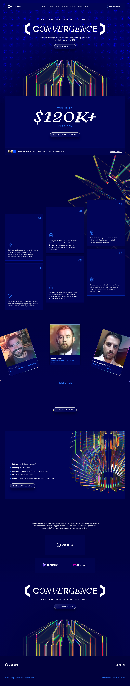

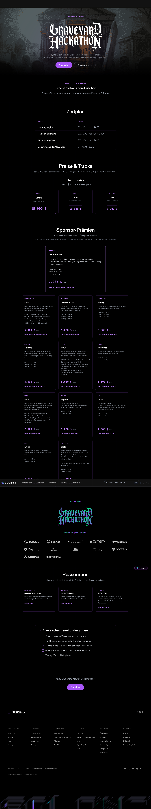

